# FractaChain: plan legal y operativo

> Cómo llevar cosechas argentinas a la blockchain de forma legal y operable, cómo se forma el mercado inicial en Kuru y qué sigue después del hackathon.
> Borrador del 9 de octubre de 2026. No es asesoramiento legal: las secciones marcadas **[a validar]** requieren la revisión de un estudio jurídico antes de operar con dinero real.

## 1. Resumen

FractaChain convierte una cosecha (por ejemplo, 100 tn de maíz de la campaña 2026/27) en **shards**: tokens que representan una fracción del valor de venta de ese lote. Los shards se colocan en una **licitación primaria** a precio fijo, se negocian después en el order book de **Kuru** sobre Monad y, cuando se vende la cosecha, se **canjean** por su parte del USDC de la venta.

La pieza legal central es esta: un token homogéneo, fungible y ofrecido al público a cambio de una parte de los ingresos de un negocio es, según la definición de la Ley 26.831, un **valor negociable** ("cualquier valor o contrato de inversión [...] homogéneos y fungibles [...] susceptibles de tráfico generalizado e impersonal"). Por eso el camino para operar con el público no es esquivar a la CNV sino usar el régimen que la CNV creó para esto: **fideicomisos financieros con oferta pública cuyos certificados de participación se representan digitalmente** (RG 1069/2025 y modificatorias, sandbox vigente hasta el 31 de diciembre de 2027 según la RG 1150/2026). Ese camino ya tiene un precedente agro aprobado en Argentina (sección 4.3).

## 2. Clase de activo y cliente

### 2.1 Activo

**Ingresos por la venta de cosechas argentinas** (soja, maíz, trigo; extensible a otros productos agropecuarios), estructurados por lote y por campaña.

- Cada lote tiene un activo identificado: tipo, cantidad, unidad y campaña. Hoy se graban onchain al emitir (`IssuanceFactory.createIssuance`).
- Un shard da derecho a `shards × monto liquidado / supply total` del USDC que el emisor deposita al vender la cosecha (`HarvestRedemption`).
- Es un activo con flujo de fondos real, estacional y con precio de referencia público (cotizaciones de granos del mercado a término), que hoy **no existe como mercado onchain líquido** en Monad.

### 2.2 Clientes

| Lado | Quién | Qué necesita |
|---|---|---|
| Emisor | Productor agropecuario o pyme agroindustrial | Financiar la campaña antes de cosechar, sin depender solo del banco o del canje con el acopio. |
| Inversor | Ahorrista local o del exterior con USDC | Exposición a un activo real argentino, con montos chicos y posibilidad de salir antes del vencimiento. |
| Socio operativo | Acopio, cooperativa o warrantera | Nuevos servicios (custodia del grano, certificación) y retención de clientes productores. |

### 2.3 Evidencia de demanda

- **Necesidad de financiamiento del productor.** Según la Bolsa de Comercio de Rosario, los productores invirtieron unos US$ 13.821 millones en la campaña 2024/25: 30 % con capital propio y 70 % con financiamiento de terceros. De ese financiamiento externo, la mayor parte vino del circuito comercial (acopios, proveedores de insumos, traders), y solo alrededor de un tercio de bancos y mercado de capitales.
- **El mercado de capitales pyme crece.** El Mercado Argentino de Valores (MAV) registró en el segundo semestre de 2025 una negociación de cheques de pago diferido de $ 5,8 billones, +139 % interanual. Los productores ya usan instrumentos negociables para financiarse.
- **Hay demanda minorista de activos agro tokenizados.** Landtoken, con un fideicomiso de campos tokenizado aprobado por la CNV, reportó más de 12.000 usuarios registrados y US$ 2,2 millones operados en dos años, con inversión mínima de US$ 50.
- **El productor ya acepta la digitalización del grano.** Agrotoken tokeniza granos depositados en acopios (1 token = 1 tonelada) desde 2022 y los usa como medio de pago y garantía de préstamos, con bancos como Santander.

Lo que **falta** en ese mapa, y aporta FractaChain: un **mercado secundario onchain abierto 24/7** para financiamiento de campaña, con formación de precio en un order book y salida anticipada para el inversor.

## 3. Naturaleza jurídica del shard

| Alternativa | Qué es | Sirve para | Límite |
|---|---|---|---|
| Compraventa de cosa futura (CCyC art. 1131) | El productor vende grano que todavía no existe; el contrato queda sujeto a que la cosa llegue a existir, salvo que el comprador asuma ese riesgo. | Contratos bilaterales o de consumo (el comprador quiere el grano). | Ofrecido en serie al público como inversión, el shard pasa a ser un valor negociable. No alcanza para una oferta abierta. |
| Certificado de depósito y warrant (Ley 9643) | Títulos que emite un almacén registrado sobre mercadería depositada: el certificado acredita la propiedad y el warrant permite usarla como garantía. El Decreto 640/2024 permite emitirlos y negociarlos electrónicamente, en cualquier formato tecnológico. | Respaldo y garantía del grano ya cosechado y depositado. | Requiere grano físico en depósito: no financia antes de la cosecha. Es un buen **activo subyacente**, no el token del inversor. |
| **Certificado de participación de fideicomiso financiero, representado digitalmente** (Ley 26.831, RG 1069/1081/1087/1150) | El productor transfiere al fideicomiso los derechos sobre la venta de la cosecha (y, cuando existe, el warrant); el fiduciario emite certificados de participación con oferta pública y la CNV autoriza su representación como tokens. | Oferta pública a minoristas, negociación secundaria y separación patrimonial del activo. | Costo y tiempos de estructuración; supervisión de la CNV; el sandbox tiene fecha de cierre. |

**Estructura elegida para operar con el público: fideicomiso financiero con oferta pública y certificados de participación digitales.** La compraventa de cosa futura y el warrant se usan **dentro** de esa estructura: el primero como contrato entre el productor y el comprador final del grano, y el segundo como garantía cuando el grano ya está depositado.

**[a validar]** Encuadre exacto del activo subyacente (derechos de cobro sobre la venta futura frente a grano depositado con warrant) y si un programa global con series por lote es admisible bajo la normativa de fideicomisos financieros de la CNV.

## 4. Estructura legal propuesta

### 4.1 Partes

El lote recorre cuatro etapas. Los números siguen el orden de los hechos; las flechas gruesas son USDC, las finas son títulos o mercadería y la punteada es la garantía.

```mermaid
flowchart LR
    subgraph E1["1 · Originación"]
        direction TB
        P(["Productor<br/><small>fiduciante</small>"])
        A["Acopio / warrantera<br/><small>registrada ante la autoridad</small>"]
    end

    subgraph E2["2 · Estructura legal"]
        direction TB
        F{{"Fideicomiso financiero<br/><small>fiduciario registrado en la CNV</small>"}}
        CP["Certificados de participación<br/><small>oferta pública CNV</small>"]
    end

    subgraph E3["3 · Mercado en Monad"]
        direction TB
        S["Shards<br/><small>representación digital<br/>RG 1069 y modif.</small>"]
        L["Licitación<br/><small>Offering</small>"]
        K["Order book<br/><small>Kuru</small>"]
        T(["Inversores"])
    end

    subgraph E4["4 · Liquidación"]
        direction TB
        V["Venta de la cosecha"]
        H["HarvestRedemption<br/><small>canje a prorrata</small>"]
    end

    P -->|"① cede derechos<br/>sobre la venta"| F
    P -->|"② deposita<br/>el grano"| A
    A -.->|"③ warrant<br/>en garantía"| F
    F -->|"④ emite"| CP
    CP -->|"⑤ se tokenizan"| S
    S --> L
    T ==>|"⑥ USDC"| L
    L ==>|"⑦ financia<br/>la campaña"| F
    L -->|"⑧ shards"| K
    K <-->|"compra / venta"| T
    A -->|"⑨ entrega"| V
    V ==>|"⑩ USDC"| F
    F ==>|"⑪ USDC +<br/>evidencia"| H
    H ==>|"⑫ USDC por<br/>cada shard"| T

    classDef real fill:#f6f1e7,stroke:#b5a582,color:#2b2b2b
    classDef legal fill:#eef2fb,stroke:#6f86c4,color:#1d2a4d
    classDef chain fill:#e6f4df,stroke:#4f9a3c,color:#173512
    classDef user fill:#fff,stroke:#4f9a3c,stroke-width:2px,color:#173512
    class P,A,V real
    class F,CP legal
    class S,L,K,H chain
    class T user
```

| Rol | Quién | Función |
|---|---|---|
| Fiduciante | Productor o pyme | Aporta los derechos sobre la venta del lote y se obliga a producir y entregar. |
| Fiduciario | Entidad inscripta como fiduciario financiero ante la CNV | Titular del patrimonio separado; emite los certificados; recibe el producido de la venta. |
| Administrador y agente técnico | FractaChain (sociedad argentina) | Originación, debida diligencia, plataforma, contratos inteligentes y reportes. |
| Depositario del grano | Acopio o warrantera inscripta en el Registro de Warranteras | Custodia, certificado de depósito, warrant y seguro de la mercadería. |
| Colocación y distribución | ALyC y PSAV inscriptos en la CNV | Colocación de la serie y acceso de inversores; el PSAV opera la versión digital. |
| Entidad generadora de la representación digital | Proveedor de tokenización admitido por el régimen | Emite y concilia los tokens con el registro de certificados. |
| Auditor y agente de control | Estudio contable | Verifica existencia del grano, liquidación de la venta y distribución. |

### 4.2 Por qué fideicomiso y no solo un contrato

- **Separación patrimonial:** si el productor o FractaChain quiebran, el lote y su producido no forman parte de su patrimonio.
- **Oferta pública legal:** permite colocar a minoristas, publicitar la licitación y negociar en un secundario.
- **Régimen ya pensado para tokens:** la RG 1069/2025 reguló primero, justamente, la representación digital de certificados de participación de fideicomisos financieros cuyo subyacente son "activos del mundo real".

### 4.3 Precedente

En agosto de 2025 la CNV autorizó la oferta pública de un fideicomiso financiero de campos productivos con certificados de participación tokenizados (programa Landtoken, fiduciario Allaria Fiduciaria S.A., operador agropecuario Adecoagro), negociables en plataformas de PSAV inscriptos. Es la primera oferta de valores negociables digitales del país bajo este régimen y muestra que la estructura es aprobable para activos agro.

## 5. Del contrato inteligente al documento legal

| Contrato (Monad) | Función legal que refleja |
|---|---|
| `KycRegistry` | Registro de inversores identificados (KYC/AML) habilitados para suscribir en la colocación primaria. |
| `IssuanceFactory` | Alta de una serie: datos del activo, supply, precio, mínimo, máximo y plazo, iguales al suplemento de prospecto. |
| `ShardToken` | Representación digital de los certificados de participación de la serie. Supply fijo, emitido una sola vez. |
| `Offering` | Período de suscripción: precio fijo, mínimo (si no se alcanza, reembolso automático), máximo y plazo. |
| Mercado en Kuru | Negociación secundaria de la representación digital. |
| `HarvestRedemption` | Distribución del producido de la venta a prorrata, con link y hash de la evidencia (liquidación del acopio). |

**Brecha conocida:** hoy el KYC aplica solo en la licitación primaria y el shard circula libre en Kuru. Para operar bajo el régimen digital de la CNV, la negociación secundaria tiene que hacerse con inversores identificados por un PSAV. La solución prevista es un **wrapper permisionado** (allowlist de direcciones verificadas por el PSAV) para la versión regulada del token. **[a validar]** Requisitos concretos del régimen sobre la negociación secundaria de valores digitales en plataformas descentralizadas.

## 6. Ciclo operativo de un lote

1. **Originación.** FractaChain y el acopio identifican al productor, verifican la superficie sembrada, el historial de rinde y el seguro agrícola.
2. **Estructuración.** Se fija el lote (cultivo, toneladas comprometidas, campaña), el precio por shard, el mínimo, el máximo y el plazo. Se emite la serie dentro del programa de fideicomiso y se aprueba el suplemento de prospecto.
3. **Licitación.** Los inversores verificados suscriben en USDC. Si se alcanza el mínimo, los fondos van al fideicomiso para financiar la campaña; si no, cada inversor recupera su aporte sin intervención de nadie.
4. **Apertura del mercado.** Al cerrar la licitación se abre el par shard/USDC en Kuru y se siembra su liquidez inicial (sección 8).
5. **Seguimiento de la campaña.** Reportes periódicos al inversor: estado del cultivo, cosecha estimada y precio de referencia.
6. **Cosecha y depósito.** El grano entra al acopio; se emiten el certificado de depósito y el warrant a favor del fideicomiso.
7. **Venta y liquidación.** Se vende el grano. El fiduciario recibe el producido, lo convierte a USDC y lo deposita en `HarvestRedemption` junto con la evidencia (liquidación del acopio, contrato de venta).
8. **Canje.** Cada tenedor canjea sus shards por su parte proporcional; los shards canjeados quedan bloqueados.
9. **Incumplimiento.** Si el productor no entrega, el fiduciario ejecuta las garantías: warrant, seguro y contratos. El smart contract garantiza el reparto; el cobro depende de esta estructura legal.

## 7. Cumplimiento

- **PSAV.** La Ley 27.739 incorporó la figura de Proveedor de Servicios de Activos Virtuales y encargó a la CNV su registro y supervisión. La RG 1058/2025 reglamenta el registro; desde el 26 de mayo de 2025 la inscripción se tramita por TAD. FractaChain, o el socio que opere la plataforma, debe inscribirse si custodia, intercambia o transfiere activos virtuales por cuenta de terceros.
- **Prevención de lavado.** KYC de inversores y emisores, monitoreo de operaciones, oficial de cumplimiento y reportes a la UIF según la normativa aplicable a PSAV y a los agentes del mercado de capitales. **[a validar]** Resolución de la UIF vigente para PSAV.
- **Transparencia.** Datos del lote grabados onchain, evidencia de la liquidación con hash verificable y actividad pública de cada operación.
- **Impuestos.** **[a validar]** Tratamiento impositivo de los certificados digitales para inversores residentes y no residentes, y del fideicomiso.

## 8. Liquidez y formación inicial del mercado

Un token sin mercado secundario no le sirve al inversor. La estrategia combina lo ya construido con incentivos para los primeros lotes.

1. **Siembra por el emisor (implementado).** Al cerrar la licitación, el emisor abre el mercado en Kuru y siembra su vault con shards no vendidos y una parte de lo recaudado, **al precio de la licitación**. El precio de apertura queda anclado al de la primaria. Probado en Monad testnet: mercado creado y vault sembrado desde la interfaz.
2. **Proveedores de liquidez (implementado).** Cualquier tenedor puede depositar shards y USDC en el vault al precio vigente y cobrar parte de las comisiones. En un fork de testnet, sumar 2.000 shards y 241,6 USDC bajó el impacto de una compra de 10 USDC de ~11 % a ~3 %.
3. **Reserva de liquidez por serie.** Un porcentaje del supply de cada lote se emite para el vault y no se vende en la licitación. Ese parámetro forma parte de la estructura del lote.
4. **Market maker designado.** Un acuerdo con un creador de mercado para mantener órdenes límite a ambos lados con spread máximo. Kuru ofrece introducciones de liquidez a equipos seleccionados.
5. **Ancla de valor.** El precio tiene una referencia externa: toneladas comprometidas × precio del grano en el mercado a término. El arbitraje entre el precio del shard y el valor esperado de la liquidación ordena el libro.
6. **Profundidad acotada al tamaño del lote.** Para la demo se usa un lote con supply grande y topes bajos, de modo que el emisor reciba shards suficientes para sembrar un vault realista.

## 9. Riesgos y mitigación

| Riesgo | Mitigación |
|---|---|
| Climático o de rinde | Seguro agrícola; topes de emisión menores a la producción esperada; diversificación por zona y cultivo. |
| Precio del grano | Información de la referencia de mercado; cobertura con futuros como opción del emisor. |
| El emisor no vende o no liquida | Fideicomiso con cesión de derechos, warrant sobre el grano depositado y obligación contractual del fiduciario. |
| Contraparte del acopio | Solo warranteras registradas, con seguro de la mercadería y auditoría de existencias. |
| Contrato inteligente | Tests, invariantes y fuzzing propios; contratos verificados en Sourcify; auditoría externa antes de mainnet. |
| Liquidez | Siembra obligatoria, reserva por serie y market maker (sección 8). |
| Regulatorio | Operación dentro del sandbox de la CNV; el sandbox vence el 31/12/2027 y las emisiones previas conservan su validez. |
| Cambiario | Liquidación en USDC; conversión del producido a cargo del fiduciario. **[a validar]** Restricciones cambiarias aplicables. |

## 10. Estado actual: qué está hecho y qué falta

| Hecho (testnet) | Falta |
|---|---|
| Emisión de lotes, licitación con mínimo, máximo, plazo y reembolso automático. | Estructura legal constituida (sociedad, fiduciario, programa). |
| KYC en la licitación primaria. | KYC en el secundario (wrapper permisionado). |
| Mercado en Kuru creado desde la app, compra, venta y liquidez del vault. | Market maker y lotes con profundidad real. |
| Liquidación de cosecha y canje proporcional con evidencia hasheada. | Acopio socio y evidencia real de una venta. |
| Wallet embebida con gas patrocinado: el usuario no necesita cripto. | Rampa de pesos a USDC y auditoría externa. |

## 11. Roadmap después del hackathon

| Fase | Objetivo | Entregables |
|---|---|---|
| 1. Piloto cerrado | Probar el ciclo completo con un lote real y un acopio socio, con inversores calificados y sin oferta pública. | Acuerdo con un acopio; un lote de maíz o soja; liquidación real en `HarvestRedemption`; auditoría externa de los contratos. |
| 2. Estructura regulada | Programa de fideicomiso financiero con series por lote y certificados digitales. | Sociedad operadora; fiduciario; inscripción PSAV propia o de un socio; wrapper permisionado; Monad mainnet. |
| 3. Escala | Varias series por campaña y liquidez sostenida. | Market maker; rampas de pesos; reportes de campaña automatizados; integración con precios de referencia. |
| 4. Nuevos activos | Ampliar a otras producciones y a crédito contra shards. | Ganadería y economías regionales; warrants electrónicos como garantía; préstamos con shards como colateral. |

## 12. Preguntas para el estudio jurídico

1. ¿Los derechos sobre la venta futura de una cosecha son un activo subyacente admisible para un fideicomiso financiero con certificados digitales, o hace falta el grano depositado con warrant?
2. ¿Puede un programa global emitir una serie por lote y por campaña con autorización simplificada?
3. ¿Qué exige el régimen para negociar los certificados digitales en un order book descentralizado como Kuru: allowlist, PSAV intermediario u otro mecanismo?
4. ¿Puede un piloto con inversores calificados operar sin oferta pública, y con qué límites?
5. Tratamiento impositivo y cambiario para inversores del exterior que suscriben en USDC.

## 13. Fuentes

- Ley 26.831 de Mercado de Capitales, art. 2 (definición de valores negociables y oferta pública): [biblioteca.afip.gob.ar](https://biblioteca.afip.gob.ar/dcp/LEY_C_026831_2012_11_29) y [CNV, oferta pública](https://www.argentina.gob.ar/cnv/pymes-en-el-mercado-de-capitales/oferta-publica-y).
- CNV, RG 1069/2025 (representación digital de valores negociables, sandbox): [Boletín Oficial](https://www.boletinoficial.gob.ar/detalleAviso/primera/326947/20250613).
- CNV, RG 1081/2025 (segunda etapa del régimen de tokenización): [Boletín Oficial](https://www.boletinoficial.gob.ar/detalleAviso/primera/330173/20250821).
- CNV, RG 1087/2025 (tokenización bajo regímenes de oferta pública automática): [Boletín Oficial](https://www.boletinoficial.gob.ar/detalleAviso/primera/333326/20251023).
- CNV, RG 1150/2026 (oferta automática y prórroga del sandbox al 31/12/2027): [Boletín Oficial](https://www.boletinoficial.gob.ar/detalleAviso/primera/343010/20260611).
- Ley 27.739 y CNV, RG 1058/2025 (registro de PSAV): [Boletín Oficial](https://www.boletinoficial.gov.ar/detalleAviso/primera/322539/20250314) y [CNV, registro PSAV](https://www.argentina.gob.ar/cnv/registro-de-proveedores-de-servicios-de-activos-virtuales).
- Ley 9643 y Decreto 640/2024 (certificados de depósito y warrants electrónicos): [Boletín Oficial](https://www.boletinoficial.gob.ar/detalleAviso/primera/310750/20240719) y [Subsecretaría de Mercados Agropecuarios](https://www.magyp.gob.ar/sitio/areas/ss_mercados_agropecuarios/_warrants/).
- Código Civil y Comercial, art. 1131 (cosa futura): [texto oficial](https://www.rpba.gob.ar/files/Normas/Leyes/CCCN1123-1707.pdf).
- Bolsa de Comercio de Rosario, financiamiento de la campaña 2024/25: [bcr.com.ar](http://www.bcr.com.ar/es/mercados/investigacion-y-desarrollo/informativo-semanal/noticias-informativo-semanal/panorama-del-5).
- Volumen del MAV, segundo semestre de 2025: [calificación ACRUP/UNTREF](https://acrup.untref.edu.ar/uploads/documents/1063518b08e5d4e3e71f8b074c7a38d72989f3494d376ac960ad7b3388c77025.pdf).
- Fideicomiso tokenizado de campos aprobado por la CNV: [AUNO Abogados](https://www.aunoabogados.com.ar/secciones/transacciones/4691-nicholson-cano-asesoro-primer-fideicomiso-tokenizado) y [Agroverdad](https://agroverdad.com.ar/2025/08/primer-fideicomiso-tokenizado-argentino-para-invertir-en-campos-la-inversion-minima-es-de-usd-50).
- Tokenización de granos en acopios: [La Nación](https://www.lanacion.com.ar/economia/campo/agrotoken-como-convertir-granos-en-activos-digitales-nid08032022/) y [Santander](https://www.santander.com/es/sala-de-comunicacion/notas-de-prensa/2022/03/santander-y-agrotoken-se-unen-para-ofrecer-prestamos-garantizados-con-criptoactivos).
